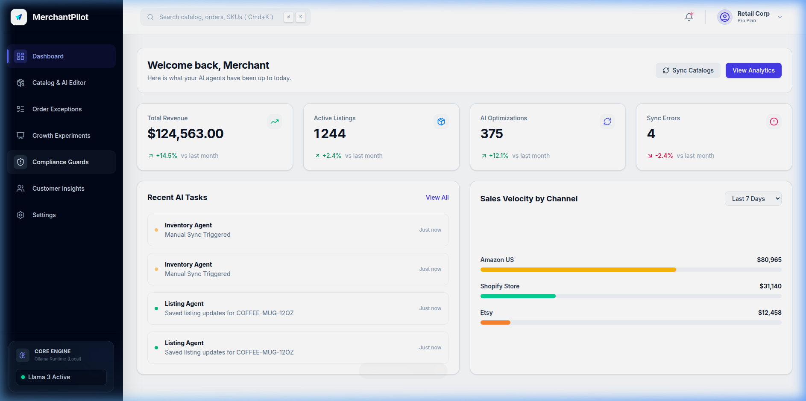
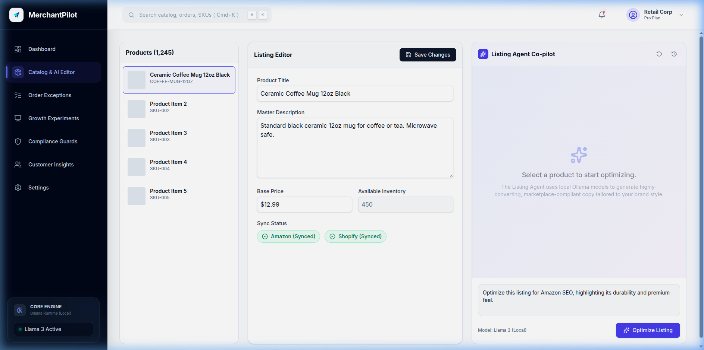
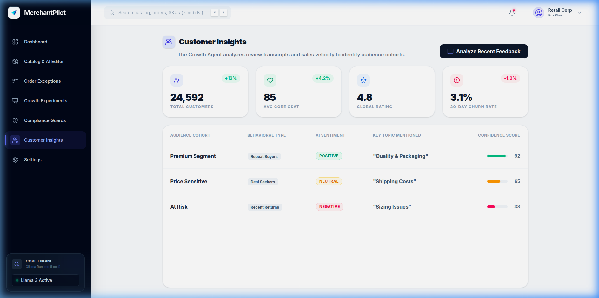

<div align="center">
  
  <h1>🚀 MerchantPilot</h1> 
  <p><strong>The AI Agent Operations Platform for Power E-commerce Sellers</strong></p>
  
  [](https://nextjs.org/)
  [](https://tailwindcss.com/)
  [](https://prisma.io/)
  [](https://ollama.ai/)
</div>

<br />  

> Small merchants selling across multiple marketplaces (Amazon, Shopify, Etsy) struggle to keep listings optimized, orders reconciled, and policies compliant. **MerchantPilot** solves this by orchestrating autonomous, local AI agents that operate as your relentless back-office team.

---

## ✨ Core Features & UI Highlights

MerchantPilot is built with a premium, sleek, and highly dynamic user interface featuring subtle glassmorphism and animated core-engine states.

### 📊 Metric Dashboard
An eagle-eye view of your connected sales channels, revenue velocity, and recent background tasks performed by your agents.



### 🤖 Catalog & AI Co-Pilot
Edit your cross-channel catalog while simultaneously chatting with the **Listing Agent**—powered entirely by local Ollama models (Llama 3, Mistral) streaming directly into the Next.js UI to generate highly-converting, SEO-optimized copy.



### 👥 Customer Insights
The **Growth Agent** automatically data-mines thousand of review transcripts and purchase trends, distilling them into distinct Behavioral Cohorts with automated AI Sentiment Analysis and Churn Prediction.



### 🚚 Order Exceptions & 🛡️ Compliance Guards
- **Exceptions**: Track fulfillment anomalies (e.g. invalid addresses, overselling) and click **"Auto-Resolve"** to let the agent automatically handle customer communications and backend refunds.
- **Compliance**: Run a full catalog scan where the AI acts as a firewall, detecting marketplace policy violations *before* you get suspended (e.g. medical claims, competitor bashing), offering **1-click auto-rewriting.**

---

## 🛠️ Tech Stack & Architecture

- **Frontend Core**: Next.js 15 (App Router), React 19, Tailwind CSS v4, Lucide Icons.
- **Backend APIs**: Next.js Serverless Route Handlers integrating fetch loops.
- **Database**: Local SQLite via Prisma ORM v5 (`@merchantpilot/core-db`), enabling instant local spin-up without Docker.
- **AI Orchestration**: Built to connect to local `ollama` endpoints (`http://localhost:11434`), ensuring complete data privacy for your catalog data without relying on expensive cloud APIs.
- **Monorepo Strategy**: Turborepo structuring for highly modular agent packages.

---

## 🚀 Getting Started (Local Dev)

The repository requires zero cloud-infrastructure dependencies. You can run the entire platform, including the AI and Database, entirely on your machine.

### 1. Database Initialization
```bash
cd packages/core-db
npx prisma db push
npx tsx seed.ts
```

### 2. Start Next.js App
```bash
cd apps/web
npm run dev
```

### 3. Connect Local Ollama (Optional but Recommended)
For local AI chat generations in the Catalog page, ensure you have Ollama installed and running in the background:
```bash
ollama serve
ollama pull llama3
```

Visit `http://localhost:3000` to access the MerchantPilot dashboard.

---

⚖️ License

This project is licensed under the MIT License © 2026 Noureddine (the-shadow-0). 📜

---
